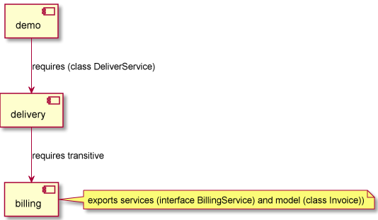

## Based on
https://www.youtube.com/watch?v=DG9B2w-N42s&list=PLgcKMlJueAM62thU14ic5FWZ3Tv-C3tOI&index=103&t=1256s

## Description 
Controller module is on top and includes main spring boot app

    module controller
    {
    requires service;
    }

Service module is injected into controller

    module service
    {
    requires email;
    requires repository;
    requires spring.data.jpa;
    exports service.doctor
    }

it uses email and repository 

    module repository
    {
    requires domain;
    exports dao.doctor;
    }

_

    module email
    {
    exports mailservice
    }

Module domain defines common models, Doctor in this example
    
    module domain
    {
    requires java.persistence;
    exports model.doctor;
    }

## Fixed problems

Fixed "Could not find acceptable representation" by

    requires com.fasterxml.jackson.core;
    requires com.fasterxml.jackson.databind;

was problem exposing controller return result
