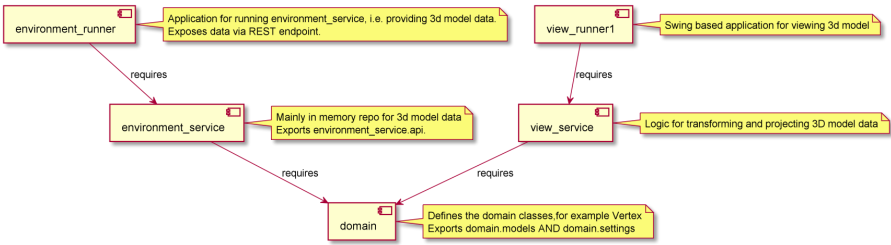
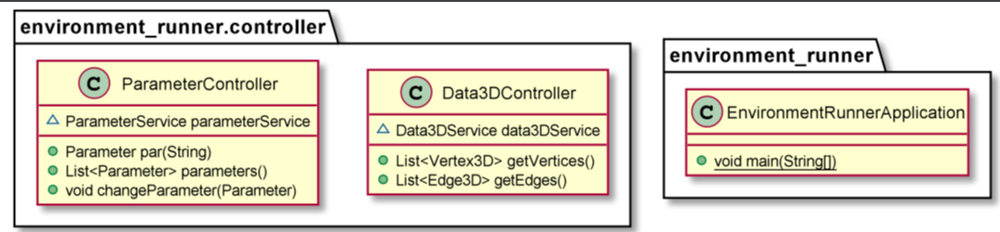
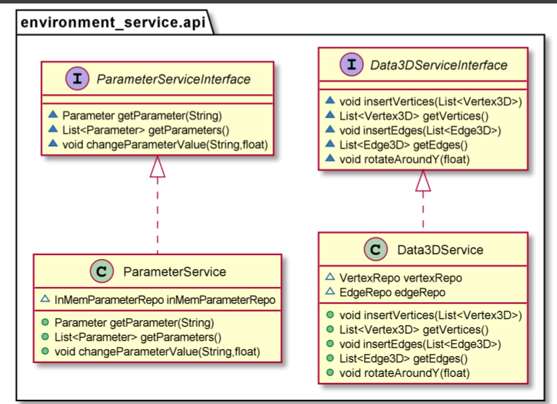
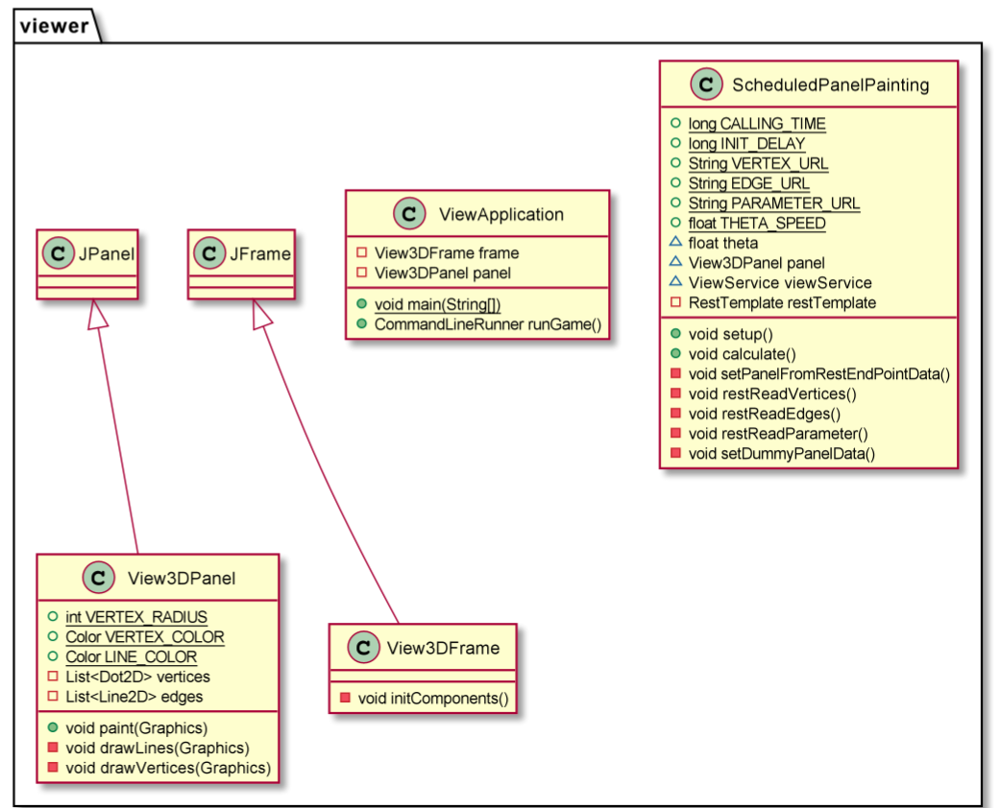
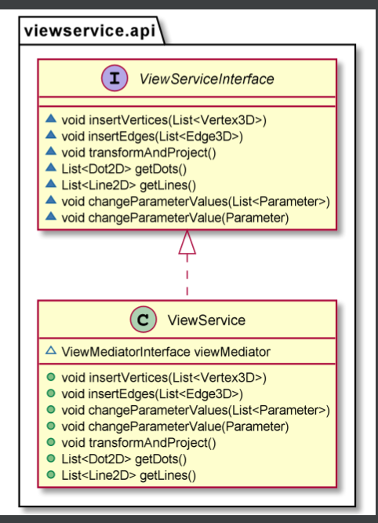
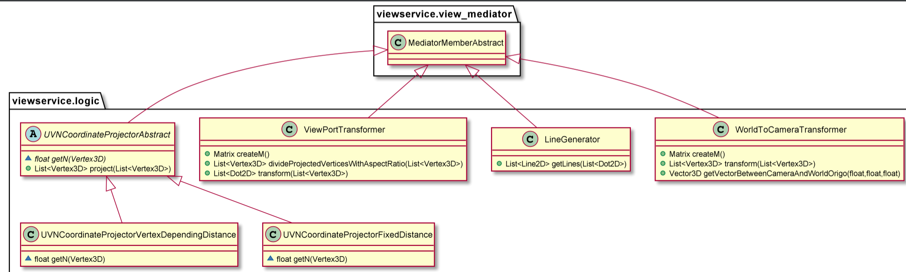
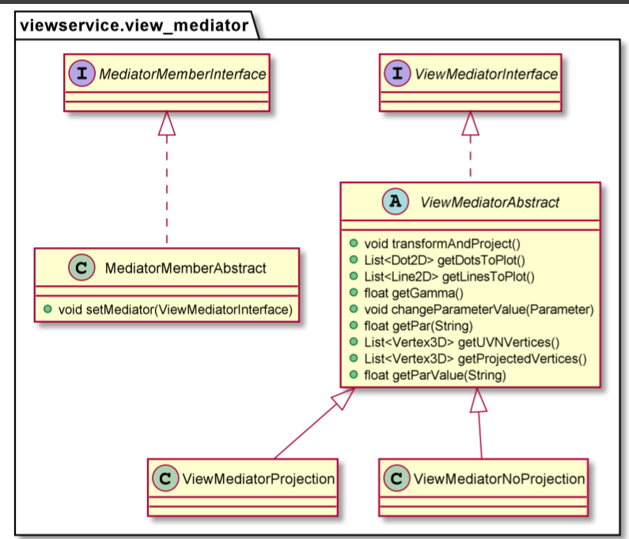

## Startup
* run EnvironmentRunnerApplication
* run ViewApplication

projection on or off is choosen by following line in ViewService

this.viewMediator = ViewMediatorInterface.newViewMediatorProjection();

## Issues
DL4J gives "Error occurred during initialization of boot layer"

http://ejml.org/wiki/index.php?title=Main_Page
gives also problems with modular setup

Apache linear algebra works with module system

## Module relations

## Class diagrams

