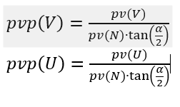

# Theory of 3D math

## 2d coordinate transformation

    pv=[1,1];                           %point in camera UV system
    U=[1,-1]; V=[1,1];                  %U and V expressed in x and y
    Unorm=U/norm(U);   Vnorm=V/norm(V); %normalize to get length 1
    M=[Unorm;                           %create transformation matrix
       Vnorm];
    pw=M*pv';                           %transform from UV to xy

pw will be (0,1.41)

## View camera

The camera defines how the observer sees the world, i.e. the viewing angles and distance to the object(s).
Cartesian right-handed coordinate system is used, right in figure below.

The figure below defines the camera and its axles. Camera view (UVN) in real world (xyz).

*	U corresponds to display x-axis and V to display y-axis.
*	It is natural but not necessary to let N go in the opposite direction of r.
*	Point in camera view coordinates is pv.
*	Point in real world coordinates is pw.

### Examples:

##	World coordinate to camera coordinates

Perpendicular row vectors of M gives

### Examples:

# Projection

A vertex point pv is projected on the U and V axes at point pvp. The projected 2D position depends on the depth distance d. 
The alpha in the figure below is the zoom factors. The figure handles V projection.

gives

### Examples

